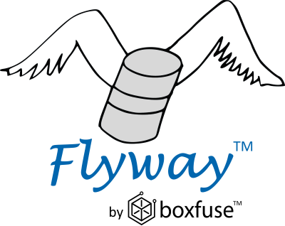

# DBRunner- DBDeploy as a Service (DBDaaS) 

- DBRunner is a lambda function that uses [flyway](https://flywaydb.org/) to apply database scripts


## Overview

- built on a serverless lambda architecture
    - no instances to manage
    - pay only for execution time
    - no server entropy, maintenance, baggage
    - each execution is brand new
- credentials and endpoint url pulled from SSM
    - "AWS Systems Manager Parameter Store provides secure, hierarchical storage for configuration data management and secrets management"
- results logged to Cloudwatch
- callable from CloudFormation

## What is Flyway?



   - Flyway is an open source tool for executing SQL scripts.
   - Its executed at the command line, runs against a remote database and returns the status of the execution.
   - Flyway maintains the history of each execution in metadata tables within the database it is run against.


## Flyway commands

## flyway migrate
Migrates the schema to the latest version. Flyway will create the schema history table automatically if it doesn’t exist.


### Note about your SQL
- Flyway runs "regular old SQL"
- There is no such thing as a "Flyway script"
- The quality of your scripts will determine if your migrations succeed
  or fail
- You must write immutable scripts
    - once applied to a db, they must not change
    - create new scripts to alter database
    - each script is a link in the chain
    - developers must understand previous changes to objects and the state of those object
    - changes must be backward and forward compatible

example:

script:
```python
## sql\\V1__Create_person_table.sql
create table PERSON (
    ID int not null,
    NAME varchar(100) not null
);
```


```python
flyway migrate -url=jdbc:mariadb://$endpoint:3306 -user=culdeedba -password=$pw -schemas=culdee_test1
```


# flyway info
Info lets you know where you stand. At a glance you will see which migrations have already been applied, which other ones are still pending, when they were executed and whether they were successful or not.


```python
flyway info -url=jdbc:mariadb://$endpoint:3306 -user=culdeedba -password=$pw -schemas=culdee_test1
```

    Flyway Community Edition 5.2.1 by Boxfuse
    Database: jdbc:mariadb://rds-sjd-culdee-dev-us-west-2-mariadb-p-01.cl3pj43didhx.us-west-2.rds.amazonaws.com:3306 (MySQL 10.0)
    Schema version: 1
    
    +-----------+---------+------------------------------+--------+---------------------+---------+
    | Category  | Version | Description                  | Type   | Installed On        | State   |
    +-----------+---------+------------------------------+--------+---------------------+---------+
    |           |         | << Flyway Schema Creation >> | SCHEMA | 2018-11-14 15:36:48 | Success |
    | Versioned | 1       | Create person table          | SQL    | 2018-11-14 15:36:49 | Success |
    +-----------+---------+------------------------------+--------+---------------------+---------+


# DBRunner is...

-  ~~DB as a Service~~ - RDS is DB as a Service

-  ~~Flyway as a Service~~  flyway is just a tiny little tool

-  ~~Migration as a Service~~ - migration means something different to most of us

-  ~~DBScripts as a Service~~ - maybe, but scripts include adhoc

- DBDeploy as a Service - **Yes**


## Create event
- payload passed to the function

```python
event={ 
 "lambda_function_name": "dbrunner",
  "schema": "culdee_test1",
  "debug": "True",
  "actions": ["migrate",'info'] , 
  "prefix1": "sjd", "prefix2": "culdee",  "env": "ops", "region": "us-west-2"
}
```

# Invoke dbrunner

```python
%%time
response=invoke(event)
pp(response)
```

    {
        "bucket": "s3-sjd-culdee-dev-us-west-2-repo",
        "results": [
            {
                "data": [
                    "Flyway Community Edition 5.0.7 by Boxfuse\n",
                    "\n",
                    "Database: jdbc:mariadb://rds-sjd-culdee-dev-us-west-2-mariadb-p-01.cl3pj43didhx.us-west-2.rds.amazonaws.com:3306 (MySQL 10.0)\n",
                    "Successfully validated 2 migrations (execution time 00:00.178s)\n",
                    "Current version of schema `culdee_test1`: 1\n",
                    "Schema `culdee_test1` is up to date. No migration necessary.\n"
                ],
                "errors": "",
                "flyway_command": "migrate",
                "return_code": 0,
                "status": true
            },
            {
                "data": [
                    "Flyway Community Edition 5.0.7 by Boxfuse\n",
                    "\n",
                    "Database: jdbc:mariadb://rds-sjd-culdee-dev-us-west-2-mariadb-p-01.cl3pj43didhx.us-west-2.rds.amazonaws.com:3306 (MySQL 10.0)\n",
                    "Schema version: 1\n",
                    "\n",
                    "+------------+---------+------------------------------+--------+---------------------+---------+\n",
                    "| Category   | Version | Description                  | Type   | Installed On        | State   |\n",
                    "+------------+---------+------------------------------+--------+---------------------+---------+\n",
                    "| Repeatable |         | << Flyway Schema Creation >> | SCHEMA | 2018-11-14 15:36:48 | Success |\n",
                    "| Versioned  | 1       | Create person table          | SQL    | 2018-11-14 15:36:49 | Success |\n",
                    "+------------+---------+------------------------------+--------+---------------------+---------+\n",
                    "\n"
                ],
                "errors": "",
                "flyway_command": "info",
                "return_code": 0,
                "status": true
            }
        ]
    }
    Wall time: 22.9 s


## The lamba function ...
- uses flyway in a lambda layer
- gets sql scripts
    - get from s3
    - unzip on local filesystem
- runs flyway commands (passed in from event)
    - prepares flyway commands from the event payload which invoked lambda
    - captures return codes, statuses and response text (exceptions, rows effected, etc)
- prepares response event with command results, messages
    - converts commmands to a dict to return to invoker
- response and logs are written to [CloudWatch](https://us-west-2.console.aws.amazon.com/cloudwatch/home?region=us-west-2#logEventViewer:group=/aws/lambda/sjd-culdee-dev-dbrunner;stream=2018/11/14/[$LATEST]c055e3a2f99d4861989d9c1dd8e6d903;start=2018-11-13T15:36:51Z)
is a link in the chain
    - developers must understand previous changes to objects and the state of those object
    - changes must be backward and forward compatible


## Beyond the scope of DBRunner
- Long running SQL
  -   you need a different strategy for running long running db changes
  -   consider build services to handle these instead of using SQL
- Complex Topics
    - Rollback
    - Forward/Backward compatibility
    - Failures
